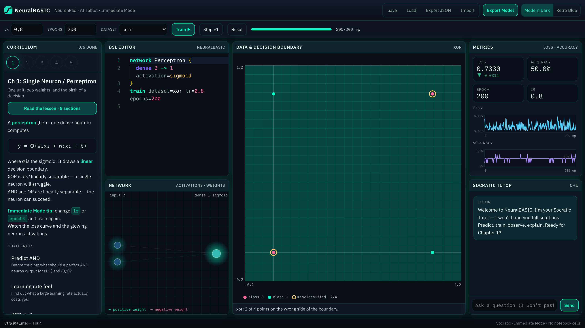

# NeuralBASIC (NeuronPad / AI Tablet)

**An interactive educational IDE for learning neural networks and modern AI** — the spiritual successor to classic QuickBASIC and [TabletBasic](https://github.com/asaptf/TabletBasic).

[](https://github.com/asaptf/NeuralBASIC/actions/workflows/ci.yml)
[](LICENSE)
[](#every-number-in-the-lessons-is-tested)

**[→ Try it in your browser](https://asaptf.github.io/NeuralBASIC/)** — no install, no account, nothing
leaves your machine.

Users should feel the same joy of immediate experimentation that people felt with BASIC in the 1980s–90s, applied to neural networks. The app forces **active construction**, **productive struggle**, and **deep intuition**. It is **not** a passive video course and **not** a ChatGPT wrapper that writes code for you.



*Chapter 1, after 200 epochs. One neuron on XOR sits at chance — the accuracy curve hugs the chance
line, two of four points are ringed, and the boundary has slid out of frame because the neuron gave up
and predicts one class everywhere. That failure is the lesson, and it is reproducible.*

---

## Vision

- **Immediate Mode** — change architecture, learning rate, or data → instant visual + numerical feedback. No notebook-style “run cell”.
- **Live visualization is the primary teacher** — the Data Lab (dataset scatter + decision boundary) is the largest panel on screen; glowing neurons, weights, loss curves and attention heatmaps sit alongside it.
- **You watch it learn** — training advances epoch-by-epoch on an animation loop, with pause, `Step +1` and an epoch progress readout. Not a jump from “before” to “after”.
- **Then you test it yourself** — every other number on screen is the model's opinion of the training set. Tap anywhere on the plot and it answers for a point that was never in the data, with a needle showing which side of the 0.5 threshold it landed on and how far. Image datasets get a grid you draw on instead: paint a bar, rub it out, paint the same bar in a corner, and watch a convolutional readout hold where a position-tied one falls apart.
- **A textbook, not captions** — each chapter opens a written lesson (~1,300 words, 7–8 sections) as a reading sheet over the workspace, because prose needs a 60–75 character measure that a 270px sidebar cannot give it. Every lesson carries runnable examples: one click loads the DSL, trains it, and drops you back in the lab with that network on screen.
- **Progress gated by demonstrated understanding** — challenges + Socratic tutor checks. Explanations are graded across *distinct concepts*, so keyword stuffing does not unlock a chapter.
- **Tablet-first** IDE with keyboard shortcuts (Ctrl/⌘+Enter to train).

### Pedagogical rules (non-negotiable)

1. The built-in **AI Tutor is strictly Socratic**: it never pastes complete working solutions first.
2. The loop is always: **predict → experiment → observe → explain**.
3. Everything is Immediate Mode; metrics and the visualizer update from the same train path.
4. Curriculum progress unlocks when challenges are completed, not when videos are watched.

---

## Quick start

```bash
npm install
npm run dev
```

Open [http://localhost:3000](http://localhost:3000).

```bash
npm test          # engine, tutor graders, persistence, curriculum, lesson figures
npm run typecheck
npm run lint
npm run build     # static export into out/
npm run preview   # serve the exported bundle
```

`npm run build` produces a fully static site in `out/` — there is no server to run, which is why
there is no `npm start`. To preview it the way GitHub Pages serves it (under a repo subpath), nest
`out/` inside a directory named after the repo and set `BASE_PATH` at build time:

```bash
BASE_PATH=/NeuralBASIC npm run build
```

Leave `BASE_PATH` unset for local work so the app stays rooted at `/`.

**Definition of Done path (Chapter 1):**

1. Open the app (Modern Dark or Retro Blue theme).
2. Chapter 1 starter is a single dense perceptron on XOR/AND.
3. Press **Train ▶** (or Ctrl/⌘+Enter) — the boundary sweeps across the Data Lab as the loss curve fills in. Use **Pause** / **Step +1** to inspect a single epoch.
4. Switch `dataset` between `and` and `xor`: AND ends at 0/4 misclassified, XOR sticks at 2/4 with the failing points ringed. That contrast *is* the lesson.
5. Tap the plot to test the trained neuron on points that were never in the data — walk a line across the boundary and watch the readout cross 0.5.
6. Chat with the **Socratic Tutor** (ask for a full solution — it will refuse and redirect).
7. Complete a challenge: predict → experiment → explain. A wrong prediction gets a nudge, not the answer; a hand-wavy explanation gets sent back.
8. **Export Model** → JSON weights + PyTorch-equivalent snippet.

---

## Tech stack

| Area | Choice |
|------|--------|
| App | Next.js 15, React, TypeScript, Tailwind CSS |
| State | Zustand |
| Editor | Monaco |
| Neural runtime | **Pure TypeScript educational engine** (`src/engine`) — fully client-side train/infer, CPU path, no WebGPU required |
| Persistence | `localStorage` + JSON import/export |
| Tutor | Deterministic offline graders + a pattern-matching Socratic mock — no LLM, no network (see [Limitations](#limitations-stated-plainly)) |
| Tests | Vitest |

### Why a pure TS engine, not TF.js?

Transparency for teaching: every weight, activation, and attention map is a plain array you can visualize each tick. Unit tests run in Node without WebGPU. The architecture keeps a clear model graph so a TensorFlow.js / WebGPU backend can be swapped behind the same `createAndTrain` / `predict` surface later.

---

## Architecture

```
src/
  engine/           # DSL parser, datasets, layers, train, probe, export
  curriculum/       # 5 chapters + challenges (data-driven, concept-tagged)
  tutor/            # Socratic system prompt, mock replies, offline graders
  store/            # Zustand Immediate Mode store + animated training loop
  components/       # IDE shell, editor, lab, network, metrics, tutor, curriculum
  lib/              # persistence, utils
  app/              # Next.js App Router entry
```

### Data flow (Immediate Mode)

1. User edits **DSL** or Immediate controls (LR / epochs / dataset).
2. **Train** parses DSL → builds model → opens a `TrainingSession` (`createTrainingSession`). The store drives `runEpoch()` from a `requestAnimationFrame` loop paced against the wall clock, so a run animates over ~2.5s whatever the epoch count — and collapses to a single synchronous run under `prefers-reduced-motion`.
3. Each epoch's `TrainStepResult` feeds **Metrics** (autoscaled loss + accuracy vs chance), the **Data Lab** (boundary grid + scatter + misclassified points), the **Network** panel (activations/weights/attention), and challenge **experiment gates**.
4. Tutor receives chapter id + DSL + last metrics; replies under Socratic policy. Predict and explain steps are graded offline by `@/tutor` — deterministic, no network call.

### NeuralBASIC DSL (minimal)

```text
network Perceptron {
  dense 2 -> 1 activation=sigmoid
}
train dataset=xor lr=0.8 epochs=200
```

Supported layers: `dense`, `conv2d`, `pool`, `flatten`, `attention`, `transformer`.  
Regularizer: `l2=0.01`. Held-out split: `val=0.3` on the train line (opt-in — it is a Chapter 3
tool and must not silently withhold data from earlier lessons).

Datasets, grouped by what they exist to teach:

| Dataset | Shape | Why it's here |
|---------|-------|---------------|
| `xor`, `and`, `or` | 4 points | Linear separability, and the wall XOR puts up |
| `linear`, `moons`, `circles`, `spiral` | 2-D scatter | Boundaries a single line can and cannot draw |
| `noisy_moons` | 2-D, labels flipped | The only 2-D set that **can** overfit — the clean ones are dense and smooth enough that memorising them also generalises, so a 32×32 net scores 100% on both train and held-out |
| `tiny_images` | 4×4 | Arrangement over intensity: both classes light exactly four pixels |
| `shifted_bars` | 8×8, motif at many positions | Where weight sharing finally pays — 50 conv parameters beat 2,642 dense ones on held-out data |
| `negation` | 4 tokens × 4 vocab | Order matters: `NOT GOOD` is negative, and no bag of words can tell it from `GOOD` |

Several of these were added because a chapter could not otherwise demonstrate its own subject. That
is worth stating plainly: three of the five chapters were blocked at some point by the app being
unable to produce the phenomenon they describe, and the fix was engine and data work rather than
prose.

**The parser rejects what it doesn't understand**, and says where:

```text
Line 2: Unknown activation `banana`. Valid activations: linear, sigmoid, relu, tanh, softmax.
```

This is a pedagogical requirement, not just hygiene. The parser used to accept anything and silently
fall back to a default `dense 2 -> 1` on `xor` — so a learner who typo'd `activaton=relu` got a
plausible result from a network they never wrote, and drew a confident wrong conclusion. Under
**predict → experiment → observe**, a silent default is worse than a crash: it corrupts the
observation. Errors surface in a strip under the editor and name the valid alternatives.

---

## Curriculum

Five chapters, each a written lesson of roughly 1,300 words opened from the sidebar, plus 2–3
challenges with **predict → experiment → explain** steps. Later chapters unlock when the previous
chapter's challenges are completed.

| # | Chapter | The limitation it turns on |
|---|---------|----------------------------|
| 1 | Single Neuron / Perceptron | One neuron draws one line, so XOR is out of reach — a geometry problem no amount of tuning fixes |
| 2 | MLP + activations | Stacked linear layers collapse into a single line; and two hidden units *can* represent XOR while solving it only 15% of the time |
| 3 | Overfitting & regularization | A perfect training score is compatible with 63% on held-out data — you cannot detect this without holding data back |
| 4 | Convolutional basics | A linear readout provably cannot tell a vertical bar from a horizontal one; and convolution only pays with a readout that discards position |
| 5 | Attention + tiny Transformer | A bag of words cannot see negation, and a model that lacks the structure fails *below chance* rather than at it |

### Every number in the lessons is tested

The lessons quote measured figures, and prose about a live system goes stale silently. So
`src/curriculum/lesson.test.ts` parses the numeric claims out of each example's `expect` text and
checks them against distributions measured over repeated runs. Editing "82%" to "95%" fails the suite.

This caught real errors while the chapters were being written. One draft claimed a high learning rate
makes the loss curve "turn violent" on `or`; measured over three runs per case, `or` at lr=20 and even
lr=50 is perfectly smooth and converges to loss ≈ 0. Another quoted ReLU and tanh as tied at 88% from
an eight-run sample; at sixty runs the real figures are sigmoid 97%, tanh 93%, ReLU 78% — every number
wrong and the ordering wrong too. Chapter 2 now says so, because small samples of a random process are
how confident false beliefs get made.

A locked chapter hides its own bugs until a learner has already earned their way in, so the curriculum
is covered by tests rather than by clicking. `src/curriculum/curriculum.completeness.test.ts` proves —
for all five chapters — that every starter program trains, every experiment gate is actually winnable,
every `explain` step accepts a genuine answer and rejects keyword stuffing, and that the unlock chain
can reach Chapter 5. Gate evaluation lives in `src/curriculum/gates.ts` and is shared by the store and
those tests, so progression can't drift from what the tests assert.

---

## Limitations, stated plainly

Worth knowing before you file an issue — these are deliberate, or at least known.

**The tutor chat is a pattern matcher, not a language model.** The "Ask a question" field routes your
text through about a dozen regular expressions covering the questions we anticipated — XOR, learning
rate, overfitting, convolution, attention, your current metrics, and "just give me the code" (which it
refuses). On those it answers well and instantly. On anything else it falls through to a generic
Socratic nudge and does not engage with what you actually asked. It also only speaks English.

This does not affect progress. Chapter unlocking is decided by the offline graders in
`src/tutor/explain.ts`, which check an explanation against *distinct concepts* so keyword stuffing
fails — that part is deterministic, tested, and needs no network. A learner who never touches the chat
completes the whole curriculum.

**The DSL editor needs network access on first load.** `@monaco-editor/react` fetches Monaco from a
CDN. With it blocked, the editor does not appear while everything else keeps working. See
[SECURITY.md](SECURITY.md) for how to self-host Monaco if that matters to you.

**Installable, and offline after one visit.** The app ships a manifest and a service worker, so it can
be installed to a home screen or desktop. Offline needs **one prior online visit** — the worker
precaches the shell and the build's hashed assets when it installs, and cannot do that before it
exists. After that a cold offline start works properly: verified with the server stopped, the app
renders styled and trains 200 epochs. Monaco is the exception, being the one asset not served from this
origin.

HTML is fetched network-first, so a deploy appears on the next online load rather than after some cache
expiry. That direction is deliberate: the lessons quote figures measured against the running engine, and
serving a stale bundle behind fresh prose is the one failure this project cannot ship. The worker
registers in production builds only, so `npm run dev` never installs it — test that behaviour against
`npm run build` and `npm run preview`.

**The engine is built for transparency, not speed.** Per-sample SGD in plain TypeScript on the CPU, so
every weight and activation is a plain array you can render each tick. Dense, conv and pool layers use
analytical backprop; attention falls back to finite differences, which is why Chapter 5's examples use
small epoch counts. Do not benchmark this against a real framework — it is a microscope, not an engine.

**Training is stochastic and figures move.** Weight initialisation and sample order are random, so the
same program gives different numbers run to run. Datasets are frozen deterministically so at least the
*data* is identical everywhere. Lesson claims are therefore ranges measured over many runs, not
promises about your next run.

---

## Themes

- **Modern Dark** — glowing neurons, cyber aesthetic (`data-theme="modern"`).
- **Retro Blue** — QuickBASIC / DOS blue-screen nostalgia (`data-theme="retro"`).

---

## Export

- **Save / Load** — browser `localStorage`.
- **Export JSON** — full experiment (DSL + config + weights + history).
- **Export Model** — `neuralbasic-model-v1` JSON + a simple **PyTorch-equivalent** training sketch.

---

## Deploying

The app is a static bundle, so it hosts anywhere that serves files. It ships to GitHub Pages from
`main` via `.github/workflows/pages.yml`.

To set this up on a fresh fork:

1. **Settings → Pages → Source: GitHub Actions.** Not "Deploy from a branch" — the workflow uploads the
   artifact itself.
2. If your repo is not named `NeuralBASIC`, change `BASE_PATH` in `.github/workflows/pages.yml` to
   `/<your-repo>`, and `homepage` in `package.json`. A project site is served from that subpath, and a
   wrong `BASE_PATH` gives a page that loads with no CSS or JS.
3. Push to `main`, or run the workflow manually from the Actions tab.

`public/.nojekyll` is committed because Pages otherwise runs Jekyll, which strips the `_next/`
directory and serves an unstyled, scriptless page.

`.github/workflows/ci.yml` runs the tests, typecheck, lint and build on every pull request.

---

## Contributing

Contributions are welcome — see [CONTRIBUTING.md](CONTRIBUTING.md), which is mostly about the one rule
that surprises people: **every number in the lessons is tested**, so editing a figure in the prose
fails the suite. It also covers the pedagogical rules a change has to respect, and why a moving lesson
figure is often a sign that the teaching changed rather than just the code.

Please also read the [Code of Conduct](CODE_OF_CONDUCT.md). For security reports, see
[SECURITY.md](SECURITY.md) — not a public issue.

---

## Inspiration

- [TabletBasic](https://github.com/asaptf/TabletBasic)
- TensorFlow Playground
- Transformer Explainer
- Andrej Karpathy — Neural Networks: Zero to Hero
- fast.ai pedagogical style

---

## License

[Apache License 2.0](LICENSE) — © 2026 Andrey Sapunov. Use, modify and redistribute freely,
including commercially; the license also grants patent rights and asks that you state your changes.
